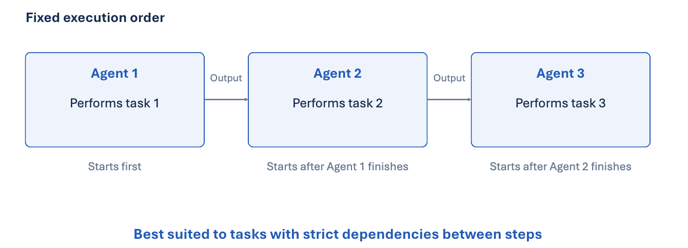
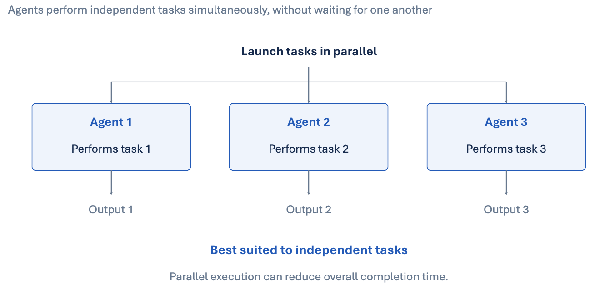
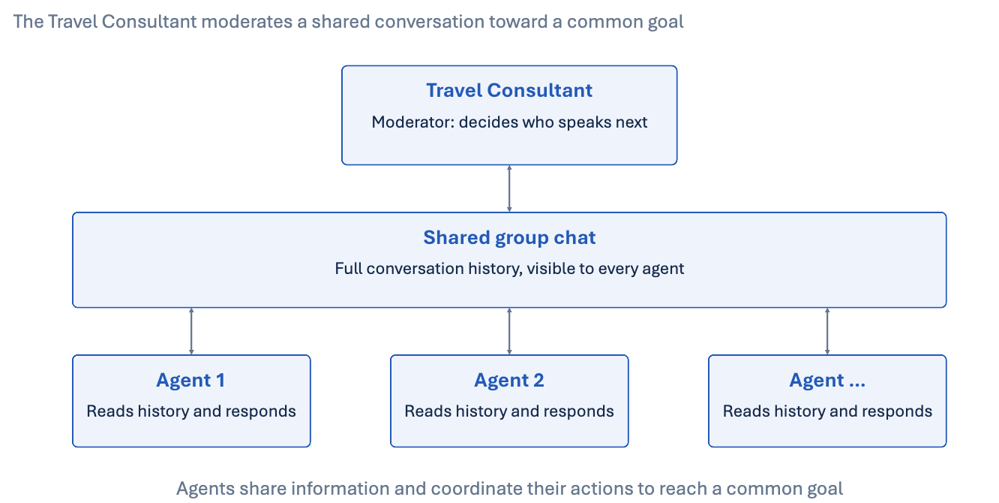
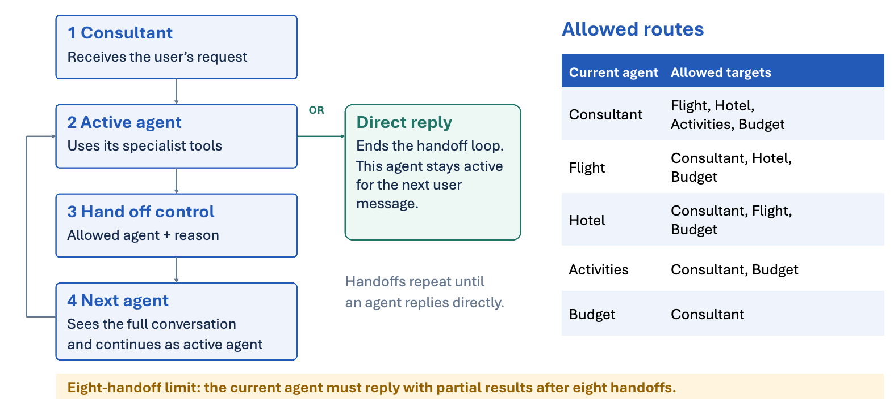
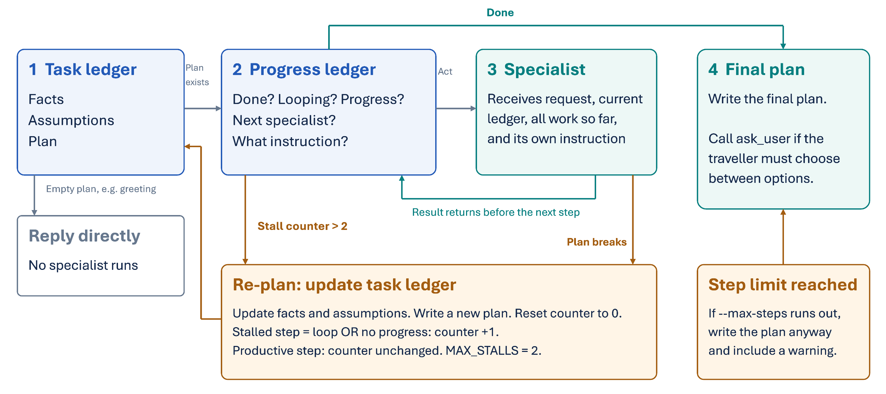
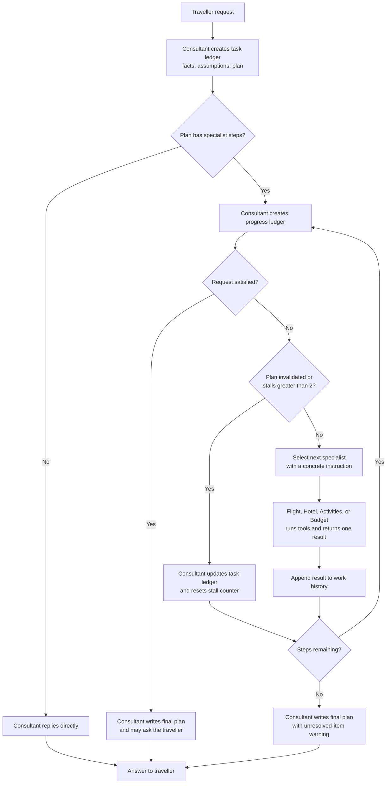

# Multi-Agent Orchestration Patterns

This project gives an overview and comparison of orchestration patterns for multi-agent systems.

It's tempting to reach for the most powerful pattern every time, but each one comes with its own trade-offs in coordination, efficiency, and flexibility.

This repo implements a fictional multi-agent travel assistant to show these patterns in action. To run the agent follow the instructions in the [README](../README.md).

Libraries such as AutoGen already help with implementing multi-agent orchestration. This repo uses a custom implementation instead, for learning purposes.

## Demo purpose

This repository demonstrates each pattern with minimal implementation complexity. The agents are LLMs with different prompts, but they run in the same process and environment. To learn how separately deployed agents can interact, see the [A2A protocol](https://a2a-protocol.org/latest/).

Below you'll find a detailed explanation and example of each pattern.

## Sequential

In the sequential pattern, agents take turns performing their tasks one after another. Each agent waits for the previous one to finish before it starts, and the execution order is fixed.

This pattern suits tasks that require a strict order of execution, where each step depends on the one before it.

Examples:
- A development loop (e.g., writing code, testing, and reviewing in a fixed sequence)

## Concurrent

A similar workflow to sequential, but agents perform their tasks simultaneously instead of waiting for one another. This pattern works well when tasks are independent, since running them in parallel can significantly improve efficiency.

Examples:
- Composing multiple independent tasks at once (e.g., fetching data from different sources in parallel)

## Group chat

Multiple agents interact in a shared group chat, coordinating their actions and sharing information to reach a common goal.

### How it works in the current implementation

A moderator agent (the Travel Consultant) coordinates the conversation and decides who speaks next. Every speaker sees the whole conversation history and answers based on all the information available.

Other ways to implement group chat:

- **Round-robin.** Everyone speaks in turn, and the moderator only decides when to stop. It's simple and predictable, but produces turns that add nothing (AutoGen uses this by default).
- **Bidding.** Each round, every agent is asked whether it has something to add, and one of the agents that says yes speaks. This is closest to "raising a hand," but costs about four times as many LLM calls. It suits tasks like collaborative problem solving or brainstorming, e.g., "Show me how my day looks" against calendar notes and similar sources.
- **Asynchronous channel.** Agents post messages to a shared channel without requiring immediate responses. The channel is a shared message log, each agent runs as its own task, and each agent decides for itself when to speak.

## Handoff

Agents pass control directly to allowed targets in `HANDOFF_GRAPH`. Each agent sees the full conversation and can hand off with a reason or reply to end the turn.

1. The Consultant receives the request.
2. The active agent uses its specialist tools.
3. It hands control to an allowed agent with a reason.
4. The next agent sees the full conversation and continues.
5. Handoffs repeat until an agent replies directly.
6. That agent remains active for the next user message.
7. After eight handoffs, the current agent must reply with partial results.

### Similarities and Differences with Group Chat

This handoff implementation can be considered a subtype of group chat: agents share the full conversation history but manage turns differently. In group chat, the Consultant decides who speaks next. In handoff, each active agent can transfer control directly to another allowed agent. Handoff is therefore a form of group chat with decentralized, graph-constrained turn management.

## Magentic

### Conceptual diagram

How a turn works:

1. The Travel Consultant, acting as manager, writes the task ledger (facts, assumptions, plan). If the plan is empty, as for a greeting, it just replies and no specialist runs.
2. Before each step, it writes a progress ledger: is the request done, is it stuck in a loop, is progress being made, who acts next, and with what instruction.
3. It re-plans when a result breaks the plan, or when the stall counter goes above `MAX_STALLS = 2`. A step counts as stalled when there's a loop or no progress. Productive steps leave the counter unchanged; a re-plan resets it. The new ledger updates the facts and assumptions and writes a new plan.
4. At the end, it writes the final plan, and can call `ask_user` if the traveller needs to choose between options. If `--max-steps` runs out first, it writes the plan anyway, with a warning.
5. Specialists receive the request, the current ledger, all work done so far, and their own instruction.

### Implementation Flow diagram

## Consultant

In each pattern, the Travel Consultant plays a different role. For a clean separation of responsibilities, only the Travel Consultant has a tool to interact with the user. The table below shows the role it plays in each pattern.

| Pattern | Consultant role | How it acts |
|---|---|---|
| Sequential | Writer | Speaks once at the end and can't send work back |
| Concurrent | Aggregator | Merges outputs from specialists who never saw each other |
| Group chat | Moderator | Chooses every speaker and can call on the same specialist again to fix a problem |
| Handoff | Coordinator | Delegates tasks to specialists and manages the handoff between them |
| Magentic | Orchestrator | Coordinates multiple agents in a magnetic-like manner, attracting and repelling tasks to optimize workflow |

## Results

Here is a comparison of the orchestration patterns, run once each on the same Lisbon weekend planning request:

> "Plan a 3-day Lisbon weekend, 9–11 October, for 3 friends. Budget CHF 1,500 total. They love food and the beach."

This is not a formal evaluation, just a stats comparison from a single run for illustration. A reliable evaluation would need multiple runs to account for variability in the agents' responses.

### Time and cost

| Pattern | Turn time | LLM calls | Total tokens | Cost vs sequential |
|---|--:|--:|--:|--:|
| Sequential | 152 s | 13 | 38,890 | 1.00 |
| Concurrent | 222 s (45 s parallel + 177 s aggregator) | 12 | 23,847 | 0.61 |
| Group chat | 120 s | 19 | 52,829 | 1.36 |
| Handoff | 73 s | 13 | 41,406 | 1.06 |
| Magentic | 148 s | 20 | 68,452 | 1.76 |

### How well it solved the problem

| Pattern | Hit the sold-out hotel | Complete plan | Total vs CHF 1,500 | Verdict |
|---|---|---|---|---|
| Sequential | Yes | Yes | ✅ CHF 1,455 (CHF 45 left) | Good, very tight buffer |
| Concurrent | No | No: Budget priced nothing | ❓ Not checked | Poor: Activities treated CHF 1,500 as its own budget, and the Sunday program clashed with the 11:45 flight |
| Group chat | Yes | Yes, plus a priced cheaper fallback | ✅ CHF 1,350 (CHF 150 left) | Best overall |
| Handoff | Yes | No: Activities never ran | ⚠️ CHF 1,020, flights and hotel only | Fastest but incomplete: Budget replied to the traveller and control never went back to the Consultant |
| Magentic | No | Yes | ✅ CHF 1,350 (CHF 150 left) | Good, but the most expensive (no re-plan) |

## When Magentic shines

The Magentic pattern is particularly useful when the task is a bit ambiguous, or when the request specifies the desired output but not the exact steps to get there.

Let's see such prompt in action.

TBD